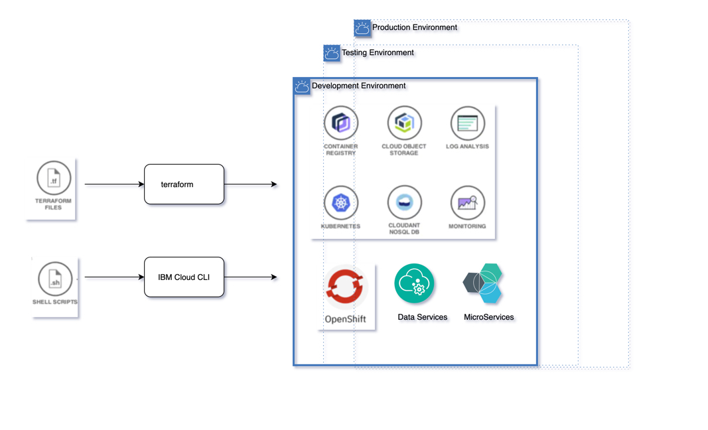
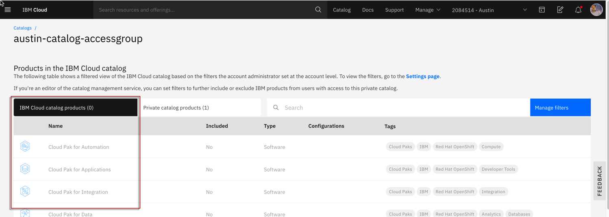
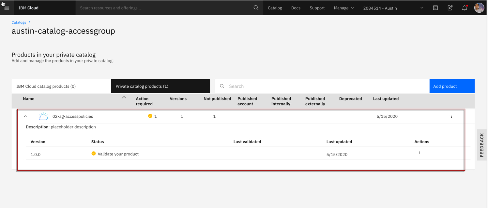
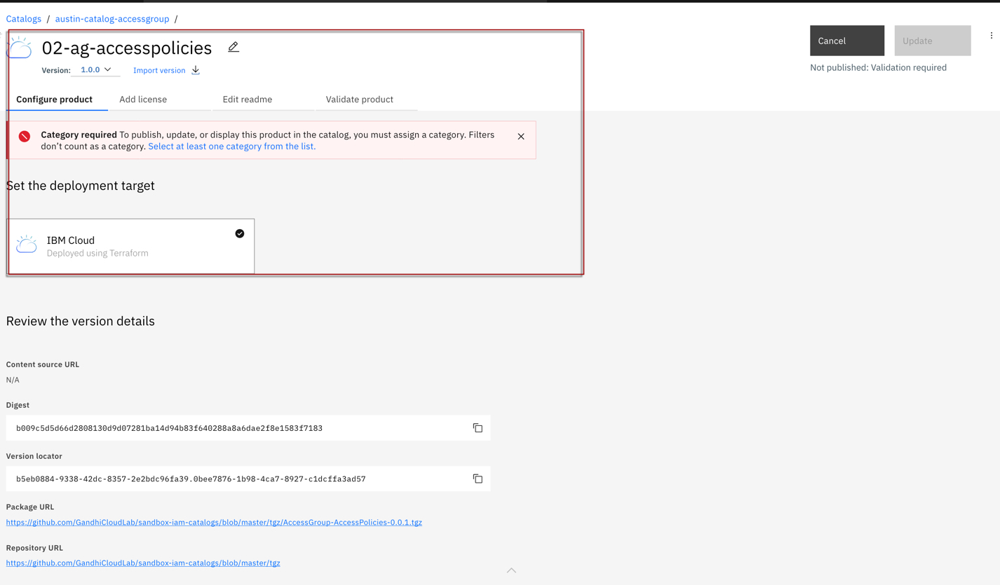
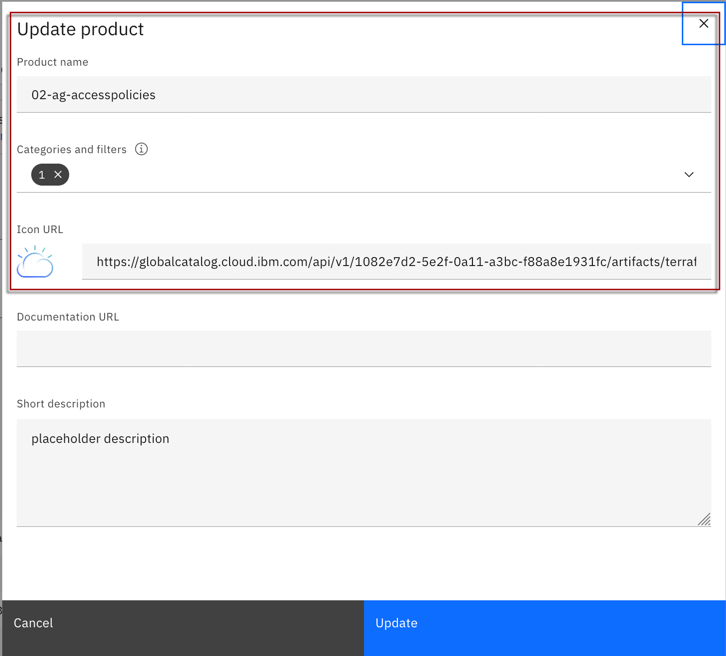
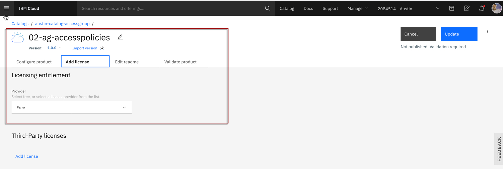
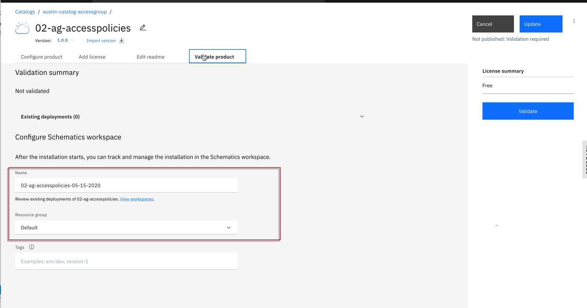
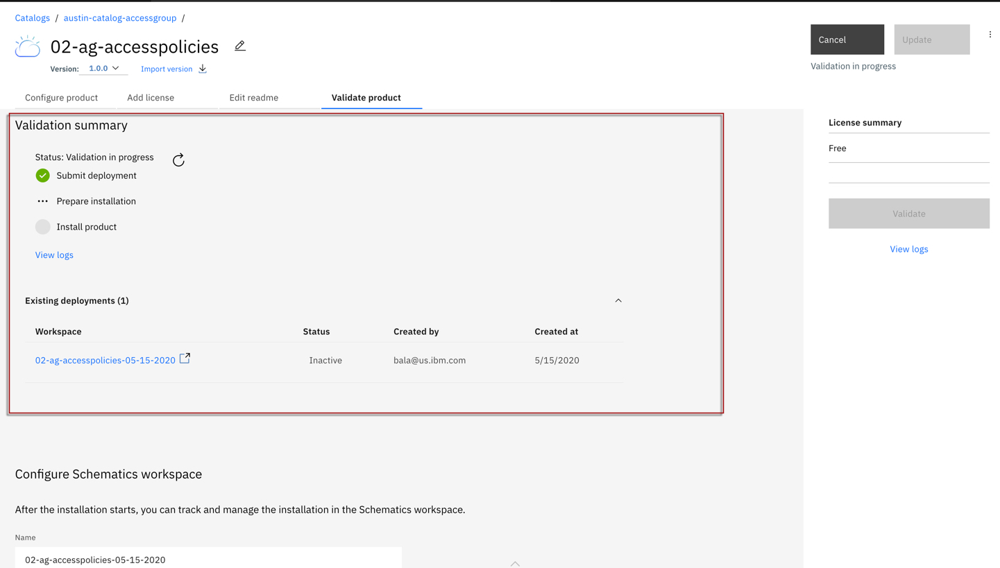

# Catalog Access Management

## Architecture
  

### 1. The catalog managment is available in latest cli. You need to update your ibmcloud cli using.

ibmcloud update

### 2. Install the plugin

ibmcloud plugin install catalogs-management

### 3. Set your target resource group.

ibmcloud target -g <Resource Group Name> 

### 4. Create a Private catalog

ibmcloud catalog create --name <Catalog Name> --description <Description> hide-ibm-public-catalog

### 5. Create a Tile. You need to pass .tgz file as an argument.

ibmcloud catalog offering create --catalog <Catalog Name> --zipurl <Tile URL>

ibmcloud catalog offerings --catalog austin-catalog-accessgroup

### 6. Verify the private catalog that is created via IBM Public Cloud console

  

  

  

### 7. Follow the walkthru of screen and Update catalogies, validate, publish and all.

  

  

  

  

  

