# Catalog Access Management

## Architecture
  

### 1. The catalog managment is available in latest cli. You need to update your ibmcloud cli using.

` ibmcloud update `

### 2. Install the plugin

`ibmcloud plugin install catalogs-management`

### 3. Set your target resource group.

`ibmcloud target -g <Resource Group Name>` 

### 4. Create a Private catalog

`ibmcloud catalog create --name <Catalog Name> --description <Description> hide-ibm-public-catalog`

### 5. Create a Tile. You need to pass .tgz file as an argument.

`ibmcloud catalog offering create --catalog <Catalog Name> --zipurl <Tile URL>`

### 6. Follow the walkthru of screen - complete activities

  

##### (A)  Configure Product
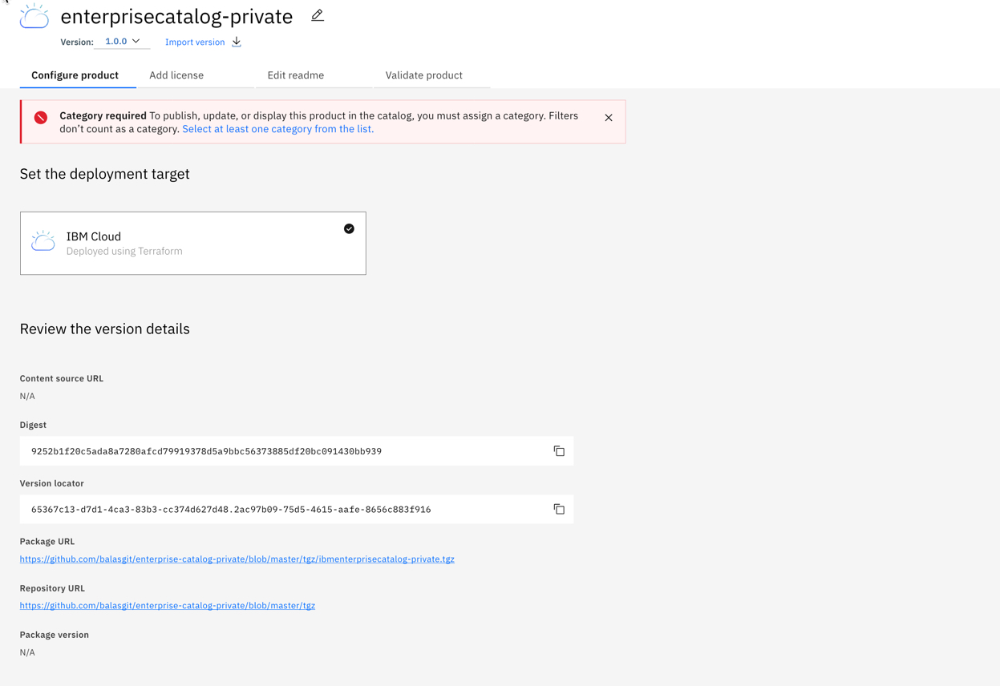

  

##### (B) Configure Category
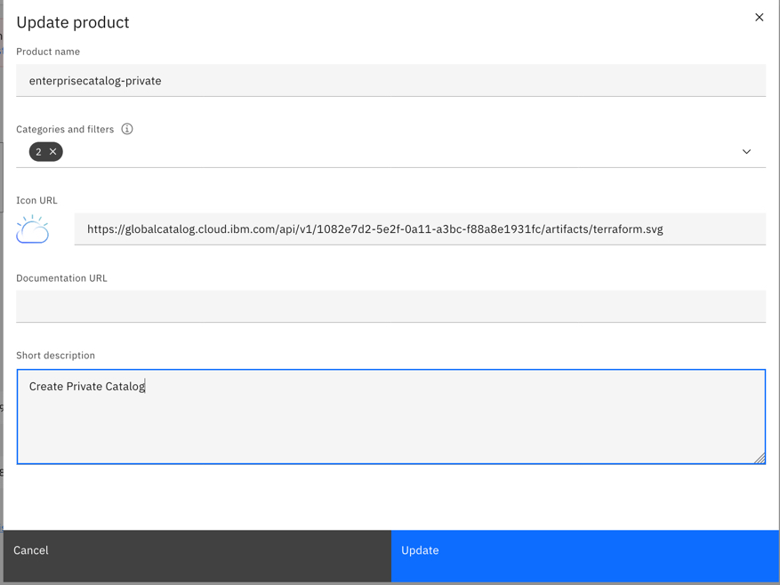

  

##### (C) Add Deployment Values
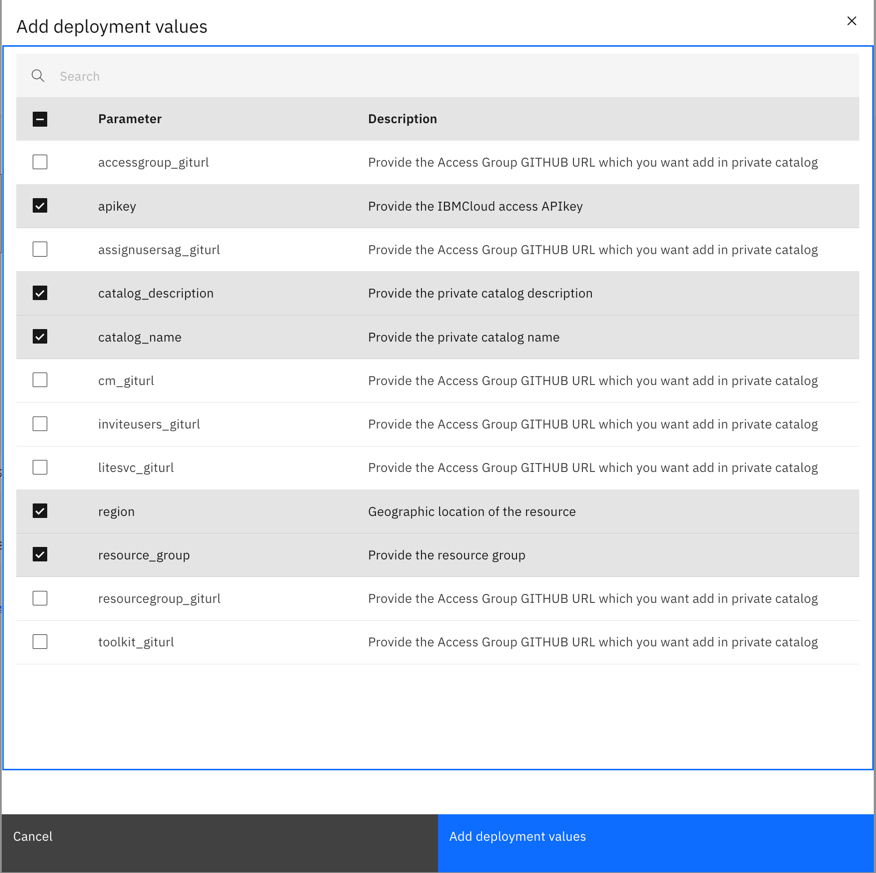

  

##### (D) Configure Deployment Values

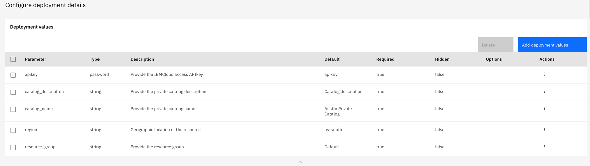

  

##### (E) Add License 
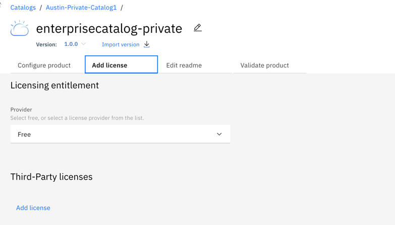

  

##### (F) Add Readme
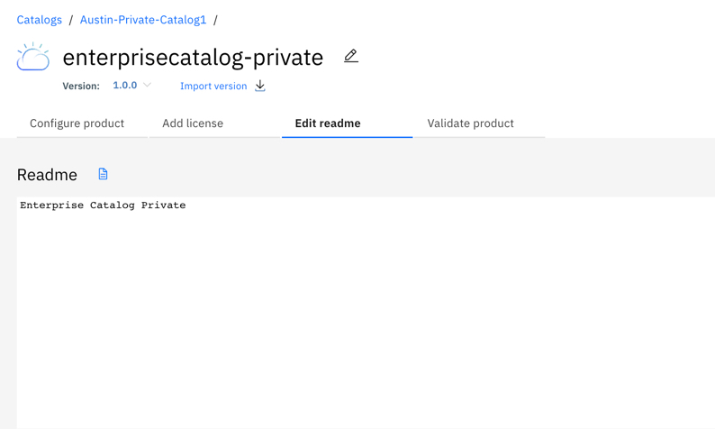

  

##### (G) Validate Product
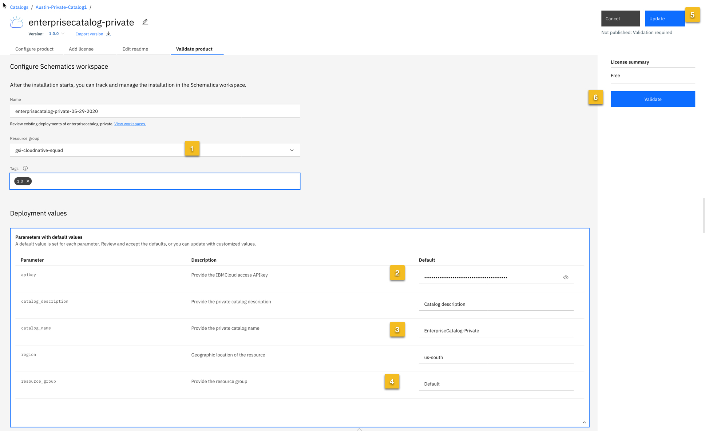

  

##### (H)  Product Validation - Summary
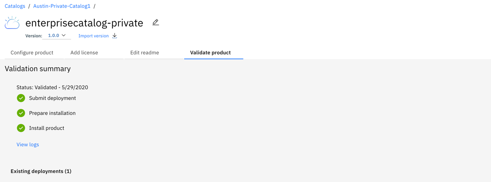

  

  

##### (I) Validated and Product Needs to be publish
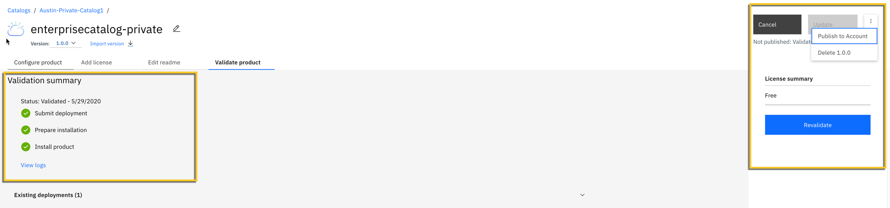

  

  

##### (J) Product Published
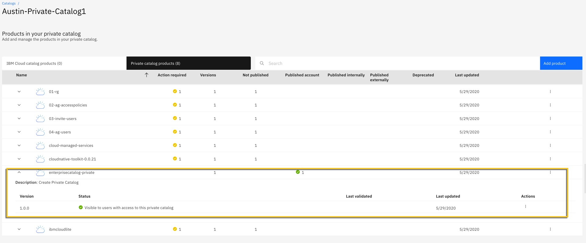

  

  

##### (K) Catalog Tile
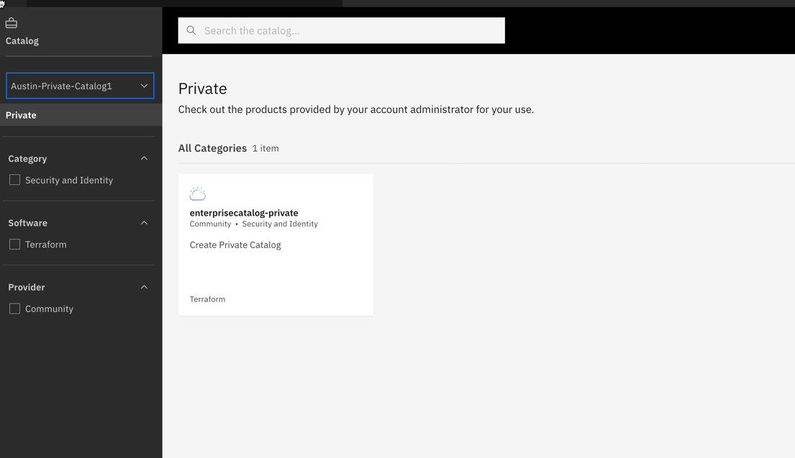

  
  

##### (L) Create Instance
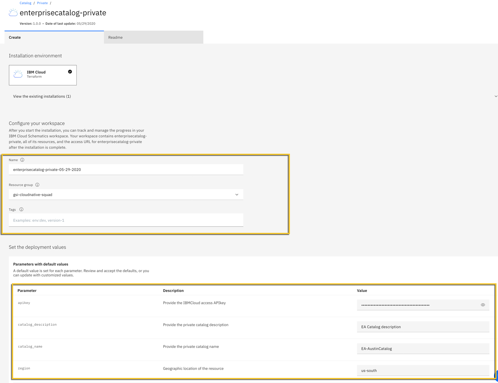

  

##### (M) Catalog Created
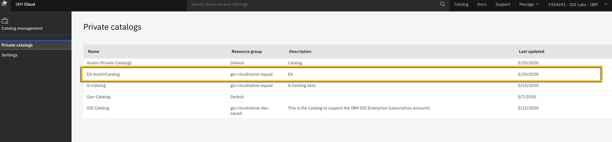

  